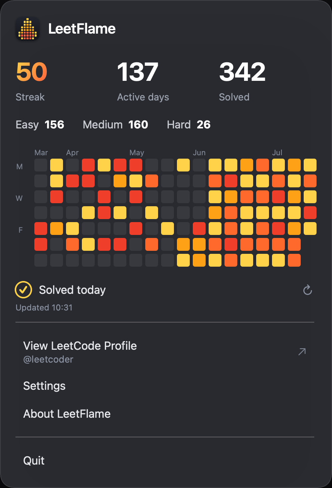

<div align="center">

# 🔥 LeetFlame

**A native macOS menu-bar app that tracks your LeetCode streak, solved counts, and daily activity — at a glance, right from the menu bar.**

[](https://github.com/idousse/leetflame/releases/latest)
[](https://swift.org)
[](https://github.com/idousse/leetflame/releases/latest)
[](LICENSE)

[**Download**](https://github.com/idousse/leetflame/releases/latest) · [Features](#features) · [How it works](#how-it-works) · [Build from source](#build-from-source)

</div>

<!--
  Recommended: add a screenshot of the popover here for maximum impact, e.g.
  <p align="center"></p>
-->

---

## Overview

LeetFlame lives in your macOS menu bar and surfaces your LeetCode progress
without a browser tab or a login. Click the flame and you get your current
streak, total problems solved, a difficulty breakdown, and a GitHub-style
contribution heatmap rendered on a warm flame gradient.

It reads only your **public** LeetCode profile through the same GraphQL API the
website uses — no credentials, no account, no backend.

## Features

- **Current streak, active days, and total solved** — the numbers that matter, up top
- **Flame heatmap** — 18 weeks of submissions on a pale-yellow → deep-red intensity scale, with per-day hover tooltips
- **Difficulty breakdown** — Easy / Medium / Hard at a glance
- **Daily status** — clear "Solved today" / "Not solved today" indicator
- **Auto-refresh** on a configurable interval, plus manual refresh
- **Configurable** — popover opacity, refresh interval, launch-at-login, and an icon-only menu-bar mode
- **Private by design** — all state lives locally; nothing leaves your machine except read-only requests to LeetCode

## How it works

LeetFlame queries LeetCode's public GraphQL endpoint (`leetcode.com/graphql`)
for the user's submission calendar and solved-count statistics, then derives
everything the UI needs on-device.

A couple of details worth calling out:

- **The current streak is computed locally.** LeetCode's own `streak` field
  returns the *longest* streak of the year, not the ongoing one — so LeetFlame
  walks the submission calendar backward from today to get the real current
  streak, treating an as-yet-unsolved today as pending rather than broken.
- **Days are bucketed in UTC.** LeetCode's daily boundary is UTC midnight;
  bucketing submissions by the local calendar would shift activity by a day in
  most timezones, so the heatmap and streak use UTC to match the source exactly.

## Requirements

- macOS 13 (Ventura) or later

## Installation

1. **[Download the latest `.dmg`](https://github.com/idousse/leetflame/releases/latest)**.
2. Open it and drag **LeetFlame** into your **Applications** folder.
3. Launch it, click the flame 🔥 in your menu bar, and enter your LeetCode username.

> **First launch:** LeetFlame is distributed outside the App Store, so on first
> open macOS asks you to confirm it. Right-click **LeetFlame → Open**, then click
> **Open** in the dialog (or approve it under **System Settings → Privacy &
> Security**). This is only needed once.

## Build from source

Requires the Swift toolchain (Xcode or the Command Line Tools).

```bash
git clone https://github.com/idousse/leetflame.git
cd leetflame

./build_app.sh            # build LeetFlame.app into .build/release/
./build_app.sh --install  # build, install to /Applications, and relaunch
./make_dmg.sh 1.0         # package a distributable .dmg
```

The app icon is generated from a pixel-flame bitmap:

```bash
swift scripts/generate_icon.swift AppIcon.iconset
iconutil -c icns AppIcon.iconset -o Assets/AppIcon.icns
```

## Architecture

Built with **SwiftUI + AppKit** and **zero third-party dependencies** — a menu-bar
`NSStatusItem` hosting a SwiftUI popover, with an async/await networking layer and
`UserDefaults`-backed persistence.

| File | Responsibility |
|---|---|
| `LeetCodeAPI.swift` | Async GraphQL request + response parsing |
| `StreakStore.swift` | Observable state, persistence, streak & heatmap computation |
| `AppDelegate.swift` | Status item, popover, settings/about windows, launch-at-login |
| `ContentView.swift` | Main popover UI |
| `HeatmapView.swift` | Contribution heatmap with tooltips |
| `SettingsView.swift` · `AboutView.swift` | Preferences and about panels |
| `PixelFlameView.swift` | Flame logo & menu-bar icon rendering |
| `Theme.swift` | Colors, gradients, and design tokens |

## License

Released under the [MIT License](LICENSE) © Ioann Dousse.

<div align="center">
<sub>Not affiliated with LeetCode. Reads only public profile data.</sub>
</div>
